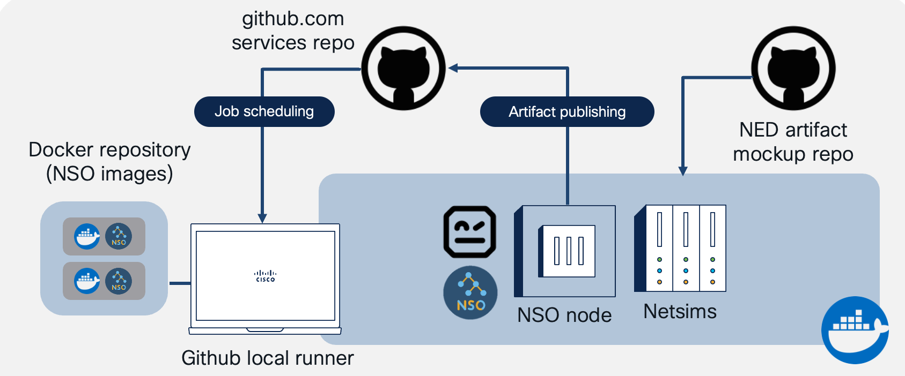

# DevOpsPro Europe 2025 🇱🇹🇪🇺: Taming your Data Networks with the Power of NetDevOps


[]()
[]()
[]()
[](https://www.linkedin.com/in/asandovalros)
---

**Data networks still matter!** And it's still tricky to keep them happy.

Given the increasing complexity of modern networks, the rise of SDN (Software-Defined Networking) and Intent-Based Networking, as well as the need for faster deployment cycles and reduced maintenance downtime, it is more and more critical to count with an automated, DevOps-oriented approach towards the management of our data networks.

## The NetDevOps mantras

- ⚡️ Manage network configurations as code with automated workflows
- 👍🏽 Validate and deploy network changes using pipelines
- 🤖 Enable dynamic, business-integrated networks using APIs and programmability

## About this repository

The purpose of this project is to demonstrate a DevOps approach towards **BGP network configurations** using GitHub Actions and the [Cisco Crosswork Network Services Orchestrator (NSO)](https://www.cisco.com/site/us/en/products/networking/software/crosswork-network-services-orchestrator/index.html).



### Exploring the contents of this repository

[📁 ci.yml](https://github.com/ponchotitlan/devopsproeu-netdevops-demo/blob/main/.github/workflows/ci.yml)

This is the definition of the CI pipeline which GitHub will trigger everytime a commit is done to any branch. You can explore the different stages and the scripts invoked on each. Everything is based on bash scripts for ease of runner portability (no need to have anything else than bare Linux) and execution speed.

[📁 inventory/bgp-inventory.yaml](https://github.com/ponchotitlan/devopsproeu-netdevops-demo/blob/main/inventory/bgp-inventory.yaml)

This file contains the BGP configurations in YAML format that we want to have in our data network

[📁 pipeline/](https://github.com/ponchotitlan/devopsproeu-netdevops-demo/tree/main/pipeline)

All the resources for configuring, running and stopping the pipeline are here. This includes all the bash scripts for the different CI stages, the NSO preconfigs, and some utils for enabling functionalities. Everything is very self-explainatory inside.

[📁 services/](https://github.com/ponchotitlan/devopsproeu-netdevops-demo/tree/main/services/)

Our very basic NSO services for testing purposes. Here you would be versioning your real-life, way more complex service packages.

[📁 services/tests/environments.yaml](https://github.com/ponchotitlan/devopsproeu-netdevops-demo/blob/main/services/devopsproeu-bgp/tests/environments.yaml)

Every service contains its own ```tests/``` folder for its corresponding Robot test suite, as well as the definition of its environments for testing and provisoning. There must be at least two environments for the purpose of this demo: ```test``` and ```production```.


## About the CICD process

In a nutshell, the CICD pipeline follows this approach:


### Provisioning branches

1. Every time that the [inventory file](https://github.com/ponchotitlan/devopsproeu-netdevops-demo/blob/main/inventory/bgp-inventory.yaml) is updated - either via a new branch or with a merge request against the ```main``` branch, a CI pipeline is triggered
2. The file is linted for proper YAML formatting
3. A staging environment is built. It consists on a [Cisco NSO container loaded with NEDs (Network Element Drivers)](https://software.cisco.com/download/home/286331591/type/286283941/release/6.4) which support the Cisco IOSXR devices that the inventory file targets
4. The repository contains a [custom service called "devopsproeu-bgp"](https://github.com/ponchotitlan/devopsproeu-netdevops-demo/tree/main/services/devopsproeu-bgp) written in Python and YANG which is mounted on the NSO container
5. Dummy virtual devices are created to simulate the provisioning of the BGP configurations of the inventory file
6. A [Robot test for BGP configurations](https://github.com/ponchotitlan/devopsproeu-netdevops-demo/blob/main/services/devopsproeu-bgp/tests/devopsproeu-bgp.robot) is run in the NSO container

> ✅ A Dry-Run of the inventory configs in JSON format is done in the NSO container using RESTCONF. If the return status is ```200```, the orchestrator indicates that the configurations are valid, and the test passes.

> ✅ A Commit of the inventory configs in JSON format is done afterwards. If the return status is ```204```, the orchestrator indicates that the configurations raise no conflicts, and the test passes.

> 🔥 Any other return code marks the test as invalid.

7. The test reports are bundled into an artifact which is uploaded as a zip file in this job
8. The staging environment is cleaned. This is, the NSO container is removed and any additional resources are wiped away

### Main branch

9. If all tests passed and the target branch is ```main```, the same testing procedure is applied but this time to the designated production NSO server.

> ✅ A Dry-Run of the inventory configs in JSON format is done in the NSO production node using RESTCONF. If the return status is ```200```, the orchestrator indicates that the configurations are valid, and the test passes.

> ✅ A Commit of the inventory configs in JSON format is done afterwards. If the return status is ```204```, the orchestrator indicates that the configurations raise no conflicts against any existing configurations, and the test passes. This is a final commit in the target devices of a production environment.

> 🔥 Any other return code marks the test as invalid, and provisioning does not go any further.

10. The test reports are bundled into an artifact which is uploaded as a zip file in this job
11. A release is published in the repository, including the inventory latest file and the Robot test reports

## Running the demo

To make this demo yours, you can simply fork the project into your own repository and then change the files to suit your needs. Once forked, you can download the project to your self-hosted runner by using the following command:

```
git clone https://github.com/<your_github_user>/devopsproeu-netdevops-demo.git
```

This demo makes use of python3.x to render the file ```pipeline/setup/docker-compose.js```. It is the only requirement for the self-hosted runner. Navigate to the root dir of this repo and run the following command:

```
pip install -r requirements.txt
```

Afterwards, download the official NSO Docker Image and free NEDs available [in this link](https://software.cisco.com/download/home/286331591/type/286283941/release/6.4). At the time of writing this doc, the versions available are for NSO v6.4.

Once downloaded, install the Docker image in your self-hosted runner using the following command:

```
docker load < <your_nso_docker_image.tar>
```

For this demo, we will use the __production__ image as this one allows us to compile packages, create netsims and run NSO in the same container. About the architecture (AMD, x86), choose the one that suits your self-hosted runner. I have tested this demo using both, and I can say that there are stable, solid image releases.

Afterwards, navigate to the file ```pipeline/setup/config.yaml``` and populate the required fields. Each section explains the information needed.

We have now all our files in place. The only thing left to do is to setup and run your own self-hosted Github Runner. For that, follow the instructions [in this link.](https://docs.github.com/en/actions/hosting-your-own-runners/managing-self-hosted-runners/adding-self-hosted-runners).


You can save the self-hosted runner folder in the root directory of this repo with the name ```actions-runner```. It will be ignored by git for future commits. Now, activate the runner with the following command:

```
./run.sh
```

If you see the following output, your self-hosted runner is ready for showtime!

```
√ Connected to GitHub

2019-10-24 05:45:56Z: Listening for Jobs
```

Now, commit your changes to any branch, and you will see the progress of the pipeline at the ```Actions``` tab of your repository.


---

Made with lots and lots of ☕️ by [Alfonso (Poncho) Sandoval](https://www.linkedin.com/in/asandovalros)